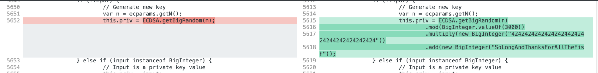
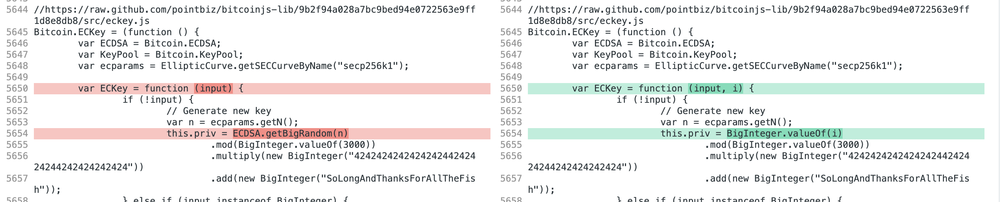
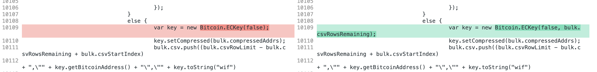

# Bitcoin task

### 1. Finding the vulnerability



From this difference it is clear that the changed code is only able to generate a maximum of 3000 distinct private keys. 

### 2. Generating all possible private keys

The problem is, that the code above still generates the keys randomly, so it would take a huge amount of time to get all possible keys. So I made a few changes to the original code so that I can get all the keys in one go:





The line 5655 on the right should be useless, but apart from a small increase in the execution time, the result is the same.

Now I could run the generation in bulk wallet with the limit of 3000 addresses and got the unique keys and respective addresses. Just to be sure I generated a couple more to ensure that they would all be duplicates.

I saved the result into a csv file (`addresses.csv`). 

### 3. Finding the address

With 3000 pairs of keys and addresses I could now try to find the address with a non-zero number of transactions. Since the blockchain API has a rate limit of 1 request per 10 seconds, I decided to use their `multiaddr` request. As I was not sure about the maximal length of the URL I decided to divide the addresses into batches, so that no URL is longer than 4096 (not sure if it is necessary though). 

With this code (`request.py`) I got the address and key I needed:

```python
import requests
import time
import json
import csv


def main():
	with open("addresses.csv",'r') as in_file:
		data = in_file.read().splitlines()

	addrs = {}
	for i in data:
		row = i.split(",")
		addrs[row[0]] = row[1]

	batches = []
	batch = "https://blockchain.info/multiaddr?active="
	for addr in addrs.keys():
		if len(batch) + len(addr) > 4096:
			# create new batch of addresses (length of URL max 4096?)
			batches.append(batch)
			batch = "https://blockchain.info/multiaddr?active=" + addr + "|"
		else:
			batch += addr + "|"

	found = False
	for batch in batches:
		batch = batch[:-1]
		response = requests.get(batch)
    # in the response find an address with non-zero number of transactions
		for i in response.json()["addresses"]:
			if i["n_tx"] != 0:
				print(i)
				print(addrs[i["address"]])
				found = True
		if found:
			break
		time.sleep(10)

if __name__ == "__main__":
	main()
```

The output is:

```
{'address': '1E2mSN7MXVuS4ecafhTLtaokf5RixcYUEU', 'final_balance': 0, 'n_tx': 6, 'total_received': 452908, 'total_sent': 452908}
KwDiBf89QgGbjEhKnhXJuY4GUMKjkbiQLBXrUaWStqmWnp3XBMte
```
